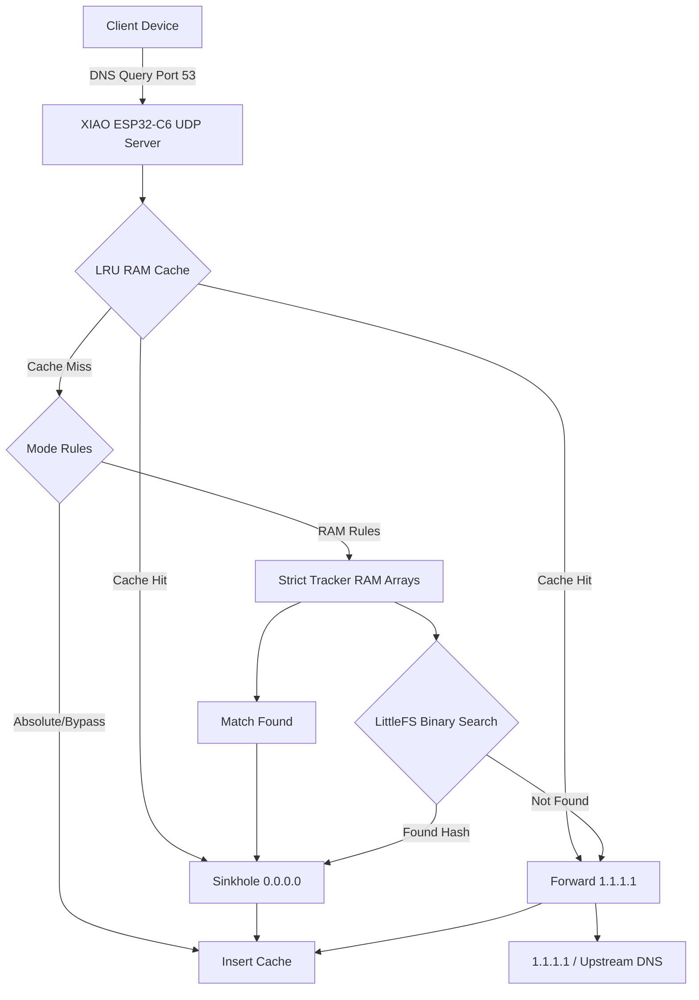

<div align="center">
  <h1>ESP32-C6 DNS Sinkhole & Adblocker</h1>
  <p><b>A high-performance, ultra-low power hardware Pi-hole alternative built for the Seeed Studio XIAO ESP32-C6.</b></p>

  
  
  
  
  
</div>

---

This embedded DNS sinkhole turns a tiny RISC-V microcontroller into a powerful network security device. Running completely on the **Seeed Studio XIAO ESP32-C6**, this project parses UDP Port 53 packets, evaluates them against a massive on-flash blocklist (~180,000 domains) using binary search, and blocks tracking/ads instantly—all while drawing less than a watt of power.

*Created by Ismam Shahin Sami (with Antigravity).*

## 🚀 Key Features & Differentiators

Unlike a traditional Raspberry Pi setup, this **ESP32 ad blocker** offers a robust, set-and-forget hardware solution:

- **Ultra-Low Power:** Draws ~0.3W peak, running 24/7 on a standard 5V phone charger.
- **Zero SD Card Corruption:** Uses wear-leveled LittleFS on onboard flash instead of a fragile MicroSD card.
- **Sub-1ms Cached Queries:** An optimized routing pipeline with an aggressive LRU Memory Cache resolves cached domains in `< 1ms`.
- **95k+ Hashes in Flash:** Leverages 40-bit FNV-1a hashes mapped into binary space to store massive blocklists without RAM fragmentation.
- **Dual-Stack IP:** Seamlessly sinkholes both IPv4 (`0.0.0.0`) and IPv6 (`::`) traffic.
- **Live Real-time Dashboard:** Built-in web server serving an interactive dashboard that tracks Client IPs and Wi-Fi dBm metrics.

## 🏗️ Architecture Diagram



## 📊 Benchmarks vs. Pi-hole (Raspberry Pi 4)

| Metric | XIAO ESP32-C6 Sinkhole | Raspberry Pi 4 (Pi-hole) |
|--------|------------------------|--------------------------|
| **Power Consumption** | ~0.3W (USB 5V) | ~3.0W to 5.0W |
| **Boot Time** | `< 2 seconds` | `30 - 45 seconds` |
| **Storage Medium** | Onboard Flash (LittleFS) | MicroSD (Prone to corruption) |
| **Dynamic Memory** | Static structs, No Fragmentation | OS managed |
| **Cost** | ~$5.00 | ~$45.00+ |

## 🛠️ Step-by-Step Installation

### Prerequisites
1. **PlatformIO:** Install the [PlatformIO CLI](https://docs.platformio.org/en/latest/core/installation.html) or the VSCode Extension.
2. **Hardware:** Seeed Studio XIAO ESP32-C6.

### 1. Build and Flash the Firmware
Connect your ESP32-C6 via USB-C and build the C++ firmware:
```bash
pio run -e esp32-c6 -t upload
```

### 2. Generate and Flash the Filesystem (LittleFS)
Generate the binary blocklist (`data/blocklist.bin`) from standard hosts files, then upload the `data/` directory (which includes the Web UI `index.html`) to the ESP32's flash memory.
```bash
python tools/generate_blocklist.py
pio run -e esp32-c6 -t uploadfs
```

### 3. Verification
Once connected to your Wi-Fi network, point a device's DNS settings to the ESP32's IP address.
Run a test using `nslookup` or `dig`:
```bash
# Test an ad domain (Should return 0.0.0.0)
nslookup doubleclick.net <ESP32_IP_ADDRESS>

# Test a clean domain (Should return Cloudflare IPs)
nslookup github.com <ESP32_IP_ADDRESS>
```

## 🔌 Hardware Power & Pinout Guide

The **Seeed Studio XIAO ESP32-C6** features an onboard ceramic antenna which works out-of-the-box. 
For 24/7 standalone deployment, you simply need to provide stable 5V power.

- **Option A:** Plug the USB-C port directly into any standard 5V USB wall adapter (like an old phone charger).
- **Option B (Direct Pin Power):** You can supply 5V to the `5V` pin and Ground to the `GND` pin if soldering onto a custom PCB.

```text
       USB-C
      -------
 5V -|       |- 3V3
GND -|       |- GND
 ... |       | ...
```

*Note: The ESP32-C6 does not suffer from "auto-sleep" issues when plugged into dumb USB wall adapters, ensuring constant uptime for your DNS resolution.*

---

## 📜 License
This project is licensed under the MIT License - see the LICENSE file for details.
